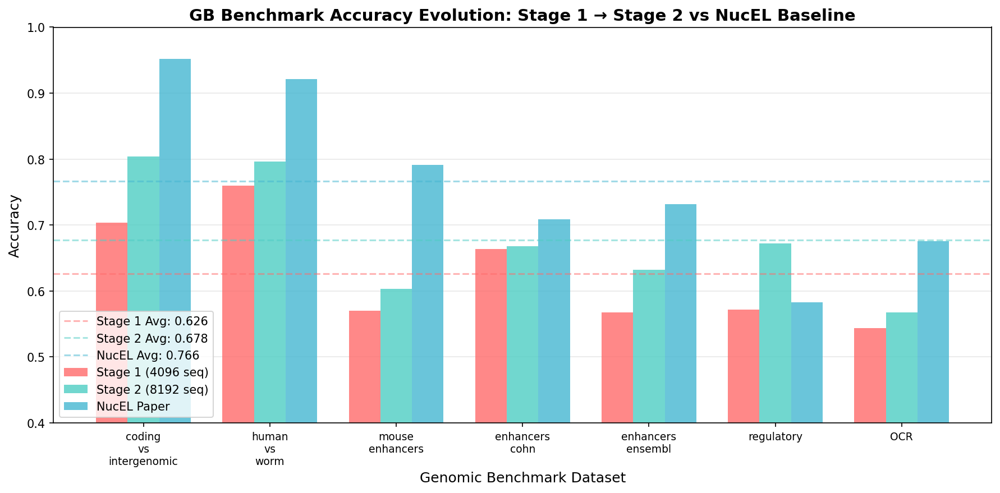

# AutoResearch Diffusion Model

Phase 4.2: DNA Diffusion with Mamba2, full hg38 training.

## Project Structure

```
AutoResearch_Diffusion_Model/
├── configs/          # Training configs
│   └── ds_config_zero0.json    # DeepSpeed Zero0 config
├── experiments/      # Experimental/benchmark scripts
├── logs/             # All log files
├── results/          # All result files (*.tsv)
├── scripts/          # Shell scripts
├── src/              # Core source code
│   ├── __init__.py
│   ├── data.py       # Dataset and data loading
│   ├── model.py      # Model architecture
│   ├── tokenizer.py  # Tokenizer
│   ├── schedule.py   # Noise schedule
│   └── eval.py       # GB evaluation functions
├── train.py          # Main training entry point
├── legacy/          # Old training scripts (Phase 1, v4, etc.)
├── docs/            # Documentation
└── checkpoints_phase4_2/  # Stage 2 checkpoints
```

## Training (Phase 4.2 Stage 2)

### Single GPU

```bash
uv run python train.py
```

### Dual GPU with DeepSpeed

```bash
# Without Wandb
uv run torchrun --nproc_per_node=2 --master_port=29500 train.py

# With Wandb
export WANDB_API_KEY=your_wandb_api_key
uv run torchrun --nproc_per_node=2 --master_port=29500 train.py --use_wandb
```

### Configuration

- **Model**: NucEL (ModernBERT 22L/512d/16h) with Mamba2 layers
- **Parameters**: 136.6M total, 136.6M trainable
- **Data**: Full hg38 (chr1-22, X, Y), 3.09B tokens
- **Seq length**: 8192
- **Batch size**: 3 per GPU
- **Optimizer**: AdamW, lr=3e-4, weight_decay=0.01
- **LR schedule**: Warmup 500 steps + cosine (min_lr=3e-5 floor)
- **Time budget**: 4 hours
- **DeepSpeed**: Zero0 (no parameter sharding)

### Custom Arguments

```bash
uv run python train.py \
  --seq_len 8192 \
  --batch_size 3 \
  --lr 3e-4 \
  --warmup_steps 500 \
  --max_steps 16000 \
  --hours 4 \
  --use_wandb \
  --wandb_project dna-diffusion \
  --wandb_run_name stage2
```

## Dependencies

- Python 3.12+
- PyTorch 2.x
- Transformers (HuggingFace)
- mamba_ssm (for Mamba2 layers)
- wandb (optional, for logging)
- deepspeed (optional, for multi-GPU training)

Install:
```bash
# Using uv (recommended)
pip install uv
uv sync

# Or with pip
pip install torch transformers mamba_ssm wandb deepspeed
```

## Phase 4.2 Results

### GB Benchmark Evolution



### Stage 1 (seq_len=4096, 8h)
- **Steps**: 10,000+
- **Val loss**: ~0.87
- **GB avg (sampled)**: 0.626
- **Key fix**: Stage 1→Stage 2 checkpoint loading remaps `_layers.*` → `backbone.layers.*`

### Stage 2 (seq_len=8192, 4h, dual GPU)
- **Steps**: 15,800 (interrupted for evaluation)
- **Val loss**: 0.8764 (step 15000)
- **GB avg (sampled)**: 0.678
- **Checkpoint**: `checkpoints_phase4_2/stage2_seq8192_step15000.pt`
- **Improvement vs Stage 1**: +0.052

### Comparison with NucEL Paper

| Dataset | Stage 1 | Stage 2 | NucEL | Δ (S2) |
|---------|---------|---------|-------|--------|
| demo_coding_vs_intergenomic_seqs | 0.704 | 0.804 | 0.952 | -0.148 |
| demo_human_or_worm | 0.760 | 0.796 | 0.922 | -0.126 |
| dummy_mouse_enhancers_ensembl | 0.570 | 0.603 | 0.791 | -0.188 |
| human_enhancers_cohn | 0.664 | 0.668 | 0.709 | -0.041 |
| human_enhancers_ensembl | 0.568 | 0.632 | 0.732 | -0.100 |
| human_ensembl_regulatory | 0.572 | 0.672 | 0.583 | **+0.089** ✅ |
| human_ocr_ensembl | 0.544 | 0.568 | 0.676 | -0.108 |
| **Average** | **0.626** | **0.678** | **0.781** | **-0.103** |

**Notes:**
- Evaluation uses 512-sequence length with 20% sampling, linear probe (10 epochs)
- `human_ensembl_regulatory` exceeds NucEL baseline by 8.9%
- Demo datasets show largest gap—may need more training steps or different evaluation strategy

## Phase 4.1 Results (for comparison)

- Best model: exp 7 (mamba2_adamw)
- Full GB avg: 0.724
- Frozen NucEL baseline: 0.703
- Improvement: +0.021
